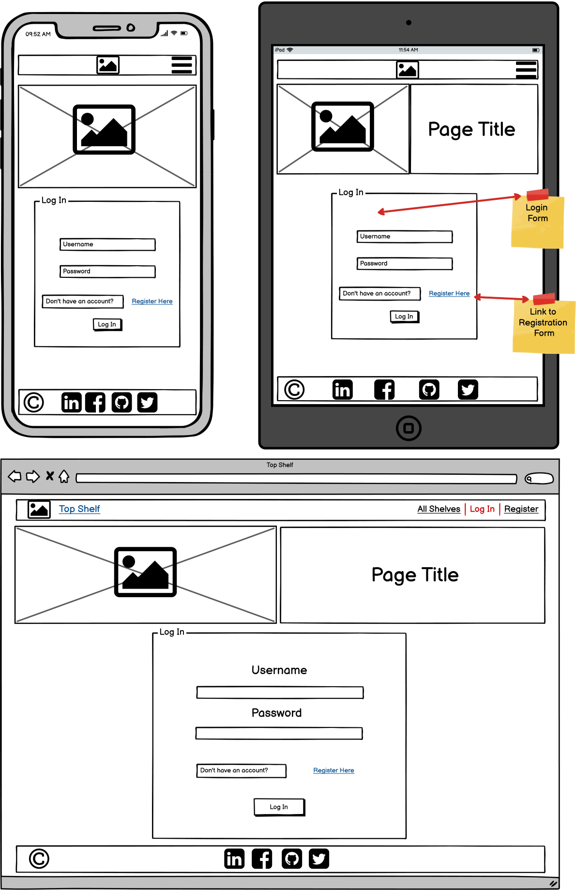
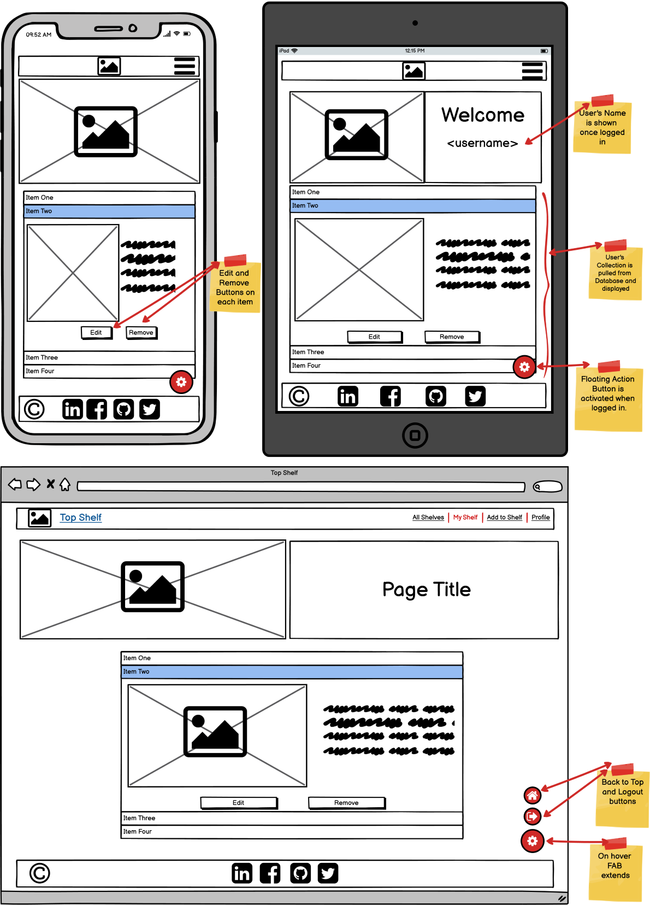

# **Third Milestone Project - Backend Development - Code Institute**

## **You can find the deployed website** [**HERE**](https://ms3-top-shelf.herokuapp.com)

# **Project Overview**

The webapp Top Shelf - Scotch is a full-stack data-centric project created in Python. It is based on the Flask framework and uses MongoDB as it's database. The project was created as the Third Milestone Project for Code Institute. 
It's main purpose is to allow the user to store and manipulate data records in a database using full CRUD (create, read, update, delete) functionality.

# **User Experience**

Users are able to create their own collection of Scotch and store them on their own personal shelf. If they choose they are able to share their collection with other users. All shared items are displayed on the home page for everyone to admire.
Users have access to full CRUD functionality on their shelf once they register an account.

# **Strategy**

##  **Project Goals**

* Use MongoDB to store user data.
* Use Python and Flask Framework to offer a way for the user to interact with the database.
* Give the users full CRUD functionality over their collections.
* Offer a responsive and mobile-friendly experience to users.

## **User Goals**

* Create an account on the webpage.
* Create and manage individual collections in the database.
* View other users' collections.

# **Scope**

## **User Stories**

**New Users:** 

1. As a new user, I want to be able to register an account.
2. As a new user, I want to be able to login and access my account.
3. As a new user, I want to be able to logout.
4. As a new user, I want to view collections in the database.
5. As a new user, I want to be able to search in the database.
6. As a new user, I want to be able to add my own items to the database.
7. As a new user, I want to be able to view my collection in the database.

**Regular Users:**

8. As a regular user, I want to be able to edit entries in my collection.
9. As a regular user, I want to be able to delete entries in my collection.
10. As a regular user, I want to be able to change my password.
11. As a regular user, I want to be able to change my avatar.

**Super Users:**

12. As a superuser, I want to be able to search the database for users and entries.
13. As a superuser, I want to be able to remove users from the database.
14. As a superuser, I want to be able to remove user created entries from the database.

**Site Owner:**

15. As a site owner, I want the app to be responsive.
16. As a site owner, I want to have users with admin privileges.
17. As a site owner, I want to showcase my social media.
18. As a site owner, I want to provide feedback to the user when errors occur.
19. As a site owner, I want forms to be validated on the client side.
20. As a site owner, I want forms to be validated on the backend as a fallback.

# **Structure**

## **Code Structure**

* app.py - contains app initialization and routes
* forms.py - contains form classes that are imported into app.py routes
* templates - contains all Flask page templates.
    - errors - contains all error page templates.
* static
    - css - contains project's global style.css.
    - js - contains project's global script.js and form_validation.js used only pages that include forms.
    - images - contains images used in the design of the app
        - icons - contains small images like logo and favicon icons
* requirements.txt - contains information on python dependencies used for this app.

## **Database Structure**

* Database document-oriented and created with [MongoDB](https://www.mongodb.com). 
* Backend is implemented using Python with the PyMongo driver

### **Conceptual Database Model**

Database concept was created using [Lucid-Chart](https://www.lucidchart.com)

  
 (Expand) Conceptual Structure.

### **Physical Database Model**

  
 (Expand) items Collection.

  
 (Expand) regions Collection.

  
 (Expand) users Collection.

## **Feature requirements**

* Responsive app for all device sizes.
* Collapsible Navigation bar on small devices.
* Landing Page showcasing (Read) items from the database.
* Registration Page with form validation.
* Login Page with form validation.
* Search feature for main collection.
* Page where users can Create entries in the database.
* Personal user collection Page with Update/ Delete functionality.
* Profile Page where users can Update personal details.
* Administration Page where superusers can Delete entries and users from the database.
* Footer with social media links.
* Logout functionality.

# **Skeleton**

## **Wireframes**

  
 (Expand) Landing Page Wireframes.

  
 (Expand) Registration Page Wireframes.

  
 (Expand) Login Page Wireframes.

  
 (Expand) User Collection Page Wireframes.

  
 (Expand) Profile Page Wireframes.

  
 (Expand) Add item to Database Page Wireframes.

  
 (Expand) Admin Management Page Wireframes.

## **App Routes**

### **Landing Page**

* Accessible from the Navbar **Logo** and the **All Shelves** link.
* Flask route: "/", "/get_items".

### **Registration Page**

* Accessible from the **Register** link in the navbar while user is logged out.
* Includes registration form validation for POST method.
* Flask route: "/register".

### **Login Page**

* Accessible from the **Login** link in the navbar while user is logged out.
* Includes login form validation for POST method.
* Flask route: "/login".

### **My Shelf Page**

* Accessible from the **My Shelf** link in the navbar while user is logged in.
* Flask route: "/my_shelf".

### **Profile Page**

* Accessible from the **Profile** link in the navbar while user is logged in.
* Flask route: "/profile/<username>".

## **Superuser Administration Page**

* Accessible from the Floating action button **Only while on profile page and logged in with superuser account**.
* Flask route: "/superuser".

## **Add Stock Page**

* Accessible from the **Add to Shelf** link in the navbar while user is logged in.
* Includes add stock form validation for POST method.
* Flask route: "/add_stock".

## **Change Stock Page**

* Accessible from the **Change** button present on each item in the dropdown collection on My Shelf Page.
* Includes add stock form validation for POST method.
* Flask route: "/change_stock/<item_id>".

## **Remove Stock functionality**

* Accessible from the **Remove from Shelf** button present on each item in the dropdown collection on My Shelf Page.
* Accessible from the **Remove from Shelf** button present on each item in the collection on Superuser Page.
* Includes confirmation modal pop-up.
* Flask route: "/remove_stock/<item_id>".

## **Remove User functionality**

* Accessible from the **Remove User** button present on each user in the collection on Superuser Page.
* Includes confirmation modal pop-up.
* Flask route: "/remove_user/<user_id>".

## **Logout User functionality**

* Accessible from the Floating action button on the bottom right corner of the page.
* Flask route: "/logout".

## **Search items functionality**

* Accessible from top of Landing Page.
* Results are limited to items with share status as TRUE.
* Flask route: "/search_items".

## **Super Search functionality**

* Accessible from top of Superuser Page.
* Results include items with share status as FALSE.
* Results are limited to normal users and not superusers.
* Flask route: "/super_search".

# **Surface**

## **Design**

### **Colour Palette**

### **Font Scheme**

# **Features**

### **Landing Page**

*User stories solved by this feature:*

* 

  
 (Expand) Landing Page on different device widths.

### **Registration Page**

*User stories solved by this feature:*

* 

  
 (Expand) Registration Feature.

### **Login Page**

*User stories solved by this feature:*

* 

  
 (Expand) Login Feature.

### **User Collection Page**

*User stories solved by this feature:*

* 

  
 (Expand) User Collection Feature 

### **Profile Page**

*User stories solved by this feature:*

* 

  
 (Expand) Profile Feature 

### **Add item to Database Page**

*User stories solved by this feature:*

* 

  
 (Expand) Add item to Database Feature 

### **Admin Management Page Page**

*User stories solved by this feature:*

* 

  
 (Expand) Admin Management Feature 

### **Navbar**

*User stories solved by this feature:*

* 

  
 (Expand) Navbar 

### **Footer**

In the footer, the user can find links the owner social medial.

*User stories solved by this feature:*

* 13 - As a site owner, I want to showcase my social media.

  
 (Expand) Footer 

### **404 Page**

The 404 Error Page is displayed in case of broken or absent links. It provides the user with the ability to go back to one of the webapp pages and maintains user engagement.

  
 (expand) 404 Error Page

## **Technologies Used**

* **[HTML5](https://html.spec.whatwg.org)**
* **[CSS3](https://www.w3.org/Style/CSS/Overview.en.html)**
* **[JavaScript](https://www.javascript.com)**
* **[JQuery 3.6.0](https://jquery.com)** Was used for dom manipulation.
* **[Github](https://github.com)** For storing my repository.
* **[Github Desktop](https://desktop.github.com)** For managing synchronizations between local and cloud-stored repositories.
* **[Git](https://git-scm.com)** For version control.
* **[VSCode](https://code.visualstudio.com)** IDE for writing code.
* **[Font Awesome](https://fontawesome.com)** Provided the icons for social media links.
* **[Google Fonts](https://fonts.google.com)** Ubuntu, Oxygen and Fira Sans font families were used as default fonts for the web application.
* **[Optimizilla](https://imagecompressor.com)** To optimize images for web applications.
* **[Favicon.io](https://favicon.io)** For creating the favicon.
* **[AmIResponsive](http://ami.responsivedesign.is)** For the multi-device mockup.
* **[Markdown ToC](https://ecotrust-canada.github.io/markdown-toc/)** Used to generate the table of contents for Readme.md

## **Testing**

### HTML validation was carried out with [W3 Validator](https://validator.w3.org).

  
 (expand) Home Page HTML Validation found 0 errors:

  
 (expand) Quiz Page HTML Validation found 0 errors, 2 warnings:

  
 (expand) Portfolio Page HTML Validation found 0 errors, 2 warnings:

  
 (expand) 404 Page HTML Validation found 0 errors:

### CSS validation was carried out with [W3 Jigsaw](https://jigsaw.w3.org/css-validator/).

  
 (expand) css.style Jigsaw Validation found 0 errors:

### Accessibility Evaluation was carried out with [WAVE Web Accessibility Evaluation Tool](https://wave.webaim.org).

  
 (expand) Home Page WAVE Validation found 0 errors, 2 alerts:

  
 (expand) Quiz Page WAVE Validation found 0 errors, 3 alerts:

  
 (expand) Portfolio Page WAVE Validation found 0 errors, 3 alerts:

  
 (expand) 404 Page WAVE Validation found 0 errors, 2 alerts:

### Performance Tests were carried out using Chrome Lighthouse DevTools.

  
 (expand) Home Page Lighthouse Test:

  
 (expand) Quiz Page Lighthouse Test:

  
 (expand) Portfolio Page Lighthouse Test:

  
 (expand) 404 Page Lighthouse Test:

### JavaScript Code Tests were carried out with [JShint](https://jshint.com).

JSHint warnings are due to the use of shorthand for IF statements and the use of JQuery where JSHint interprets "$" as an unknown variable.

  
 (expand) email.js JSHint found 0 errors:

  
 (expand) home.js JSHint found 0 errors 1 warning:

  
 (expand) quiz.js JSHint found 0 errors 1 warning:

  
 (expand) quiz_data.js JSHint found 0 errors:

  
 (expand) portfolio.js JSHint found 0 errors, 3 warnings:

### Devices used for physical testing: 

* Samsung Galaxy S8,
* Samsung Tab A 9.7-inch tablet,
* 17-inch 1080p Laptop (Google Chrome, Mozilla Firefox, Opera, Microsoft Edge browsers),
* 24-inch 1080p Display (Google Chrome, Mozilla Firefox, Opera, Microsoft Edge browsers),
* 32-inch 2040p Display (Google Chrome, Mozilla Firefox, Opera, Microsoft Edge browsers).

Application performs as intended on all devices.

## **Testing of User Stories**

_GitHub does not allow videos hosted in the local repository to be played on the repository page.
Although when viewing on GitHub these videos appear fine, they might not be available in this format if this project is forked. Please refer to the Local Links if needed._

### 1. As a new user, I want to see recent data on major crypto-currencies by market capitalization.

|Feature | Action | Expected Result | Actual Result |
| --- | --- | --- | --- |
| Coin Badges on Landing Page | Load Landing Page. Hover over individual badges. | View current price for each currency. View 24 hour price highs and lows. | Works as expected |

  
 (Expand - User Story 1 testing video) 

  https://user-images.githubusercontent.com/79543676/140587509-0f297a4c-b235-48f1-add7-e797432f4f5a.mp4

  [Local Link](docs/test_user_stories/user_story_1_test.mp4)

### 2. As a new user, I want to add personal crypto-currency assets.

|Feature | Action | Expected Result | Actual Result |
| --- | --- | --- | --- |
| Portfolio Page | Click the "Portfolio" Link in navbar. Click on Asset Input Field. Input symbol, name or select from list the asset. Click on "Enter amount" Input Field. Enter amount. Click "Add" button. | See the asset added to the table. | Works as expected |

  
 (Expand - User Story 2 testing video) 

  https://user-images.githubusercontent.com/79543676/140587736-5d87a52a-8c8d-4aab-a639-995638890542.mp4

  [Local Link](docs/test_user_stories/user_story_2_test.mp4)

### 3. As a new user, I want to see the asset valuation.

|Feature | Action | Expected Result | Actual Result |
| --- | --- | --- | --- |
| Asset table on Portfolio Page | Assets added as described in User Story 2 are stored in Local Storage. Refresh Page, view table containing assets. | View current price and valuation for each asset added. | Works as expected |

  
 (Expand - User Story 3 testing video) 

  https://user-images.githubusercontent.com/79543676/140587959-09b0f953-1d3e-4860-af74-68dfcda3cd13.mp4

  [Local Link](docs/test_user_stories/user_story_3_test.mp4)

### 4. As a new user, I want to see the total portfolio valuation.

|Feature | Action | Expected Result | Actual Result |
| --- | --- | --- | --- |
| Current Portfolio Value section at the top of Portfolio Page | Refresh Page. View total portfolio valuation. | See the total valuation of all assets. | Works as expected.

  
 (Expand - User Story 4 testing video) 

  https://user-images.githubusercontent.com/79543676/140588272-5daa2760-1f20-4c34-95ac-5e3d054a532b.mp4

  [Local Link](docs/test_user_stories/user_story_4_test.mp4)

### 5. As a new user, I want to learn new information relating to the blockchain.

|Feature | Action | Expected Result | Actual Result |
| --- | --- | --- | --- |
| Quiz Page | Click the Quiz Link on the navigation bar. Click the start button on the quiz. Play the game. | Find information related to the blockchain. | Works as expected |

  
 (Expand - User Story 5 testing video) 

 
  https://user-images.githubusercontent.com/79543676/140588329-9636efce-2a13-4e88-9e22-93e0315f6c33.mp4

  [Local Link](docs/test_user_stories/user_story_5_test.mp4)

### 6. As a new user, I want to learn more about the knowledge quiz.

|Feature | Action | Expected Result | Actual Result |
| --- | --- | --- | --- |
| Quiz info button in the quiz title | Click on the information button. | See modal with information about the quiz. | Works as expected |

  
 (Expand - User Story 6 testing video) 

  https://user-images.githubusercontent.com/79543676/140588369-5b27cec6-1fd5-4d6e-a3d4-1142d739b90c.mp4

  [Local Link](docs/test_user_stories/user_story_6_test.mp4)

### 7. As a regular user, I want to store my portfolio data.

|Feature | Action | Expected Result | Actual Result |
| --- | --- | --- | --- |
| Add asset section on portfolio page | Click on portfolio link in navigation bar. Add asset as described in User Story 2. Close page / browser. Open page again. | To see added assets persist through different browsing session. See added data stored in Local Storage | Works as expected |

  
 (Expand - User Story 7 testing video) 

  https://user-images.githubusercontent.com/79543676/140588411-7e35764d-4540-418d-bdbb-b4aca894e4d0.mp4

  [Local Link](docs/test_user_stories/user_story_7_test.mp4)

### 8. As a regular user, I want the option to change the current webapp color theme.

|Feature | Action | Expected Result | Actual Result |
| --- | --- | --- | --- |
| Theme Switch in the Navbar | Click the theme switch in the Navbar | Page color scheme to change | Works as expected |

  
 (Expand - User Story 8 testing video) 

  https://user-images.githubusercontent.com/79543676/140588507-401f9bdd-999f-4bcf-8af4-13aa38fea442.mp4

  [Local Link](docs/test_user_stories/user_story_8_test.mp4)

### 9. As a regular user, I want the ability to edit previous portfolio entries.

|Feature | Action | Expected Result | Actual Result |
| --- | --- | --- | --- |
| Portfolio Page input fields and trash bin icons | To change the Holding amount of an existing asset, select the same asset in the dropdown menu and input new amount. To remove asset from table click the trash bin icon in the asset's table row. | Updated amount to show in table when updating. Asset to be removed when clicking trash bin. | Works as expected |

  
 (Expand - User Story 9 testing video) 

  https://user-images.githubusercontent.com/79543676/140588553-39bdb347-bf92-49c2-a5ac-56e3c12a9d17.mp4

  [Local Link](docs/test_user_stories/user_story_9_test.mp4)

### 10. As a regular user, I want to test the previously acquired knowledge.

|Feature | Action | Expected Result | Actual Result |
| --- | --- | --- | --- |
| End screen on quiz game | Click on try again button at the end of the quiz | The quiz game starts over and offers the chance to gain a better score and better completion time | Works as expected |

  
 (Expand - User Story 10 testing video) 

  https://user-images.githubusercontent.com/79543676/140588603-f212437f-b608-4cd6-b7b4-f3445ee00d1e.mp4

  [Local Link](docs/test_user_stories/user_story_10_test.mp4)

### 11. As a site owner, I want the knowledge quiz to be versatile and easy to update.

|Feature | Action | Expected Result | Actual Result |
| --- | --- | --- | --- |
| quiz_data.js script housing all the questions and answers for the quiz | Open project repository. Locate quiz_data.js in assets/js/. Open quiz_data.js and replace questions and answers. The quiz data is displayed dynamically thus making it easy for variable number of answers to be displayed for one question and not being hard coded in HTML to a specific number. | View new questions being displayed in the quiz. | Works as expected |

  
 (Expand - User Story 11 testing video) 

  https://user-images.githubusercontent.com/79543676/140588644-1648d384-a124-4d29-a357-085bc7a9844f.mp4

  [Local Link](docs/test_user_stories/user_story_11_test.mp4)

### 12. As a site owner, I want to provide the user a way to get in contact.

|Feature | Action | Expected Result | Actual Result |
| --- | --- | --- | --- |
| Email modal that uses EmailJS API | Click on "Get in touch" Link in the Navbar. Fill in the input fields. Click Send | Validation when the API sends the message to the site owners inbox. | Works as expected |

  
 (Expand - User Story 12 testing video) 

  https://user-images.githubusercontent.com/79543676/140588680-4250c1ec-af3e-48f5-8bfa-d4512ff0b61d.mp4

  [Local Link](docs/test_user_stories/user_story_12_test.mp4)

### 13. As a site owner, I want to showcase my social media.

|Feature | Action | Expected Result | Actual Result |
| --- | --- | --- | --- |
| Social media links in the page footer | Click on the social media icons in the page footer | Social media pages to open in new tab. | Works as expected |

  
 (Expand - User Story 13 testing video) 

  https://user-images.githubusercontent.com/79543676/140588734-cf40597a-d084-48f9-8e8f-e13823850f84.mp4

  [Local Link](docs/test_user_stories/user_story_13_test.mp4)

## **Bugs**

## **Deployment**

The website is hosted and deployed from Github. The steps taken for deployment were:

1. Logged into my [Github](https://github.com) account,
2. Selected the [Repository](https://github.com/CristianBuca/The-Aunans),
3. Go to [Settings](https://github.com/CristianBuca/The-Aunans/settings),tab on the horizontal menu,
4. Go to [Pages](https://github.com/CristianBuca/The-Aunans/settings/pages) tab on the vertical sub-menu,
5. Selected the **Main Branch** from the drop-down menu under **Source**,
6. Selected the **/(root)** folder where my **index.html** was located,
7. Clicked **Save**,
8. Once the page was refreshed I was presented with the link to the live website as seen in the image below:

**Steps to follow for cloning this repository:**

1. Log into your [Github](https://github.com) account,
2. Select the [Repository](https://github.com/CristianBuca/The-Aunans),
3. Click on the drop-down menu title **Code** on the top right of the repository file tree,
4. Copy the HTTPS address,
5. In your Git Bash Terminal type *"git clone"* then paste the address.

*Alternatively you can download the repository as ZIP or use [Github Desktop](https://desktop.github.com) to ge the repository on you local machine*

## **Credits**

_I have followed dozens of projects and video tutorials trying to find the solutions that would fit this project.
Some influenced my approach on how to build this site and others were specific to a particular issue I encountered.
Any code that was borrowed has been modified and adapted to fit my particular needs._

**JavaScript/Jquery code:**

**HTML/CSS**

* Using CSS Variables [Fireship](https://www.youtube.com/watch?v=NtRmIp4eMjs).
* CSS style for the Theme Switch checkbox was taken from [Online Tutorials](https://www.youtube.com/watch?v=z3TgmTi42ic).
* For the Quiz Info Modal I watched [Florin Pop](https://www.youtube.com/watch?v=XH5OW46yO8I).
* CSS for the custom buttons was inspired from [CSS Scan](https://getcssscan.com/css-buttons-examples).
* The pop-up in the e-mail form for invalid entries was taken from [W3 Schools](https://www.w3schools.com/howto/howto_js_popup.asp) in combination with [PreTagTeam](https://pretagteam.com/question/jquery-position-popup-in-relative-to-buttons) for positioning it on each input.

**Media**

* Quiz questions/ answers and layout from [CoinTelegraph](https://cointelegraph.com/quiz/think-you-know-the-crypto-basics-take-our-quiz-to-find-out).
* Quiz images from [Pexels](https://www.pexels.com/search/cryptocurrency/).
* 404 Page background image from [Stockvault](https://www.stockvault.net).

### **Code Institute colleagues who's work I followed for guidance:**

[Paul Meeneghan](https://github.com/pmeeny/CI-MS2-BicepMusicFanSite).

## **Acknowledgements**

* Special thanks to my mentor Mo Shami for his suggestions and guidance.
* My family for their encouragement and support.
* Special thanks to Neil from Student Care for helping me through a tough time and everyone else in the Student Care Team that touched bases making sure I am on track.
* The Code Institute team for all the effort and energy they put into creating and curating the content for this programme.

## Disclaimer

_This project is for educational use only and was created as a Milestone Project for the Code Institute Module of Interactive Frontend Development_

Developed by Cristian Buca

