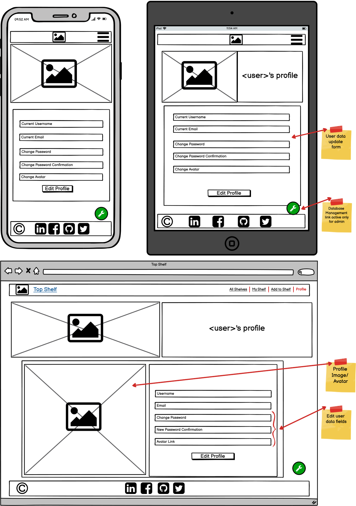
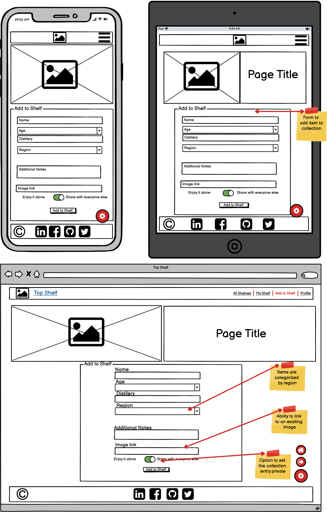

# **Top Shelf**

## **Third Milestone Project - Backend Development - Code Institute**


## **You can find the deployed website** [**HERE**](https://ms3-top-shelf.herokuapp.com)

# **Project Overview**

The webapp Top Shelf - Scotch is a full-stack data-centric project created in Python. It is based on the Flask framework and uses MongoDB as it's database. The project was created as the Third Milestone Project for Code Institute. 
It's main purpose is to allow the user to store and manipulate data records in a database using full CRUD (create, read, update, delete) functionality.

For testing purposes I have set up the account with user: topshelftest and password: Password1

# **User Experience**

Users are able to create their own collection of Scotch and store them on their own personal shelf. If they choose they are able to share their collection with other users. All shared items are displayed on the home page for everyone to admire.
Users have access to full CRUD functionality on their shelf once they register an account.

# **Strategy**

##  **Project Goals**

* Use MongoDB to store user data.
* Use Python and Flask Framework to offer a way for the user to interact with the database.
* Give the users full CRUD functionality over their collections.
* Offer a responsive and mobile-friendly experience to users.

## **User Goals**

* Create an account on the webpage.
* Create and manage individual collections in the database.
* View other users' collections.

# **Scope**

## **User Stories**

**New Users:** 

1. As a new user, I want to be able to register an account.
2. As a new user, I want to be able to login and access my account.
3. As a new user, I want to be able to logout.
4. As a new user, I want to view collections in the database.
5. As a new user, I want to be able to search in the database.
6. As a new user, I want to be able to add my own items to the database.
7. As a new user, I want to be able to view my collection in the database.

**Regular Users:**

8. As a regular user, I want to be able to edit entries in my collection.
9. As a regular user, I want to be able to delete entries in my collection.
10. As a regular user, I want to be able to change my password.
11. As a regular user, I want to be able to change my avatar.

**Super Users:**

12. As a superuser, I want to be able to search the database for users and entries.
13. As a superuser, I want to be able to remove users from the database.
14. As a superuser, I want to be able to remove user created entries from the database.

**Site Owner:**

15. As a site owner, I want the app to be responsive.
16. As a site owner, I want to have users with admin privileges.
17. As a site owner, I want to showcase my social media.
18. As a site owner, I want to provide feedback to the user when errors occur.
19. As a site owner, I want forms to be validated on the client side.
20. As a site owner, I want forms to be validated on the backend as a fallback.


[Back to Top](#Top-shelf)


# **Structure**

## **Code Structure**

* app.py - contains app initialization and routes
* forms.py - contains form classes that are imported into app.py routes
* templates - contains all Flask page templates.
    - errors - contains all error page templates.
* static
    - css - contains project's global style.css.
    - js - contains project's global script.js and form_validation.js used only pages that include forms.
    - images - contains images used in the design of the app
        - icons - contains small images like logo and favicon icons
* requirements.txt - contains information on python dependencies used for this app.

## **Database Structure**

* Database document-oriented and created with [MongoDB](https://www.mongodb.com). 
* Backend is implemented using Python with the PyMongo driver

### **Conceptual Database Model**

Database concept was created using [Lucid-Chart](https://www.lucidchart.com)

<details>
  <summary> (Expand) Conceptual Structure.</summary>


</details>

### **Physical Database Model**

<details>
  <summary> (Expand) items Collection.</summary>


</details>

<details>
  <summary> (Expand) regions Collection.</summary>


</details>

<details>
  <summary> (Expand) users Collection.</summary>


</details>

## **Feature requirements**

* Responsive app for all device sizes.
* Collapsible Navigation bar on small devices.
* Landing Page showcasing (Read) items from the database.
* Registration Page with form validation.
* Login Page with form validation.
* Search feature for main collection.
* Page where users can Create entries in the database.
* Personal user collection Page with Update/ Delete functionality.
* Profile Page where users can Update personal details.
* Administration Page where superusers can Delete entries and users from the database.
* Footer with social media links.
* Logout functionality.


[Back to Top](#Top-shelf)


# **Skeleton**

## **Wireframes**

<details>
  <summary> (Expand) Landing Page Wireframes.</summary>


</details>

<details>
  <summary> (Expand) Registration Page Wireframes.</summary>


</details>

<details>
  <summary> (Expand) Login Page Wireframes.</summary>


</details>

<details>
  <summary> (Expand) User Collection Page Wireframes.</summary>


</details>

<details>
  <summary> (Expand) Profile Page Wireframes.</summary>


</details>

<details>
  <summary> (Expand) Add item to Database Page Wireframes.</summary>


</details>

<details>
  <summary> (Expand) Admin Management Page Wireframes.</summary>


</details>

## **App Routes**

**Landing Page**

* Accessible from the Navbar **Logo** and the **All Shelves** link.
* Flask route: "/", "/get_items".

**Registration Page**

* Accessible from the **Register** link in the navbar while user is logged out.
* Includes registration form validation for POST method.
* Flask route: "/register".

**Login Page**

* Accessible from the **Login** link in the navbar while user is logged out.
* Includes login form validation for POST method.
* Flask route: "/login".

**My Shelf Page**

* Accessible from the **My Shelf** link in the navbar while user is logged in.
* Flask route: "/my_shelf".

**Profile Page**

* Accessible from the **Profile** link in the navbar while user is logged in.
* Flask route: "/profile/<username>".

**Superuser Administration Page**

* Accessible from the Floating action button **Only while on profile page and logged in with superuser account**.
* Flask route: "/superuser".

**Add Stock Page**

* Accessible from the **Add to Shelf** link in the navbar while user is logged in.
* Includes add stock form validation for POST method.
* Flask route: "/add_stock".

**Change Stock Page**

* Accessible from the **Change** button present on each item in the dropdown collection on My Shelf Page.
* Includes add stock form validation for POST method.
* Flask route: "/change_stock/<item_id>".

**Remove Stock functionality**

* Accessible from the **Remove from Shelf** button present on each item in the dropdown collection on My Shelf Page.
* Accessible from the **Remove from Shelf** button present on each item in the collection on Superuser Page.
* Includes confirmation modal pop-up.
* Flask route: "/remove_stock/<item_id>".

**Remove User functionality**

* Accessible from the **Remove User** button present on each user in the collection on Superuser Page.
* Includes confirmation modal pop-up.
* Flask route: "/remove_user/<user_id>".

**Logout User functionality**

* Accessible from the Floating action button on the bottom right corner of the page.
* Flask route: "/logout".

**Search items functionality**

* Accessible from top of Landing Page.
* Results are limited to items with share status as TRUE.
* Flask route: "/search_items".

**Super Search functionality**

* Accessible from top of Superuser Page.
* Results include items with share status as FALSE.
* Results are limited to normal users and not superusers.
* Flask route: "/super_search".


[Back to Top](#Top-shelf)


# **Surface**

## **Design**

The design of the site is inspired by an opened bottle of Scotch and is maintained through all pages.
It is a mobile-first design that is fully responsive on all device sizes. Top section includes hero image and title and represents the neck of the bottle. Main section has a white background and content is centered resembling the label on the bottle. Footer color and size is supposed to remind the users of the scotch left in the bottle that they can still enjoy.


**UI**

Top Shelf Scotch makes use of the (MaterializeCSS)[https://materializecss.com] UI component library which is created and designed by Google and is also known as Material Design.

**Typography**

As the app is using MaterializeCSS library it inherits a lot of it's fonts as fallback. For the main components I have opted to overwrite those fonts with Barlow Condensed imported from Google Fonts library.
Barlow is a slightly rounded, low-contrast, grotesk type family.


**Color Palette**


Colors for this app were inspired by the colors a user would find when looking at a bottle of Scotch.


[Back to Top](#Top-shelf)


# **Features**

### **Landing Page**

The Landing Page features the hero image and the search feature in at the top of the page which users are able to take advantage of and search the database for a specific item.
Main content of the page is comprised of a card grid that is responsive to the user's device width. Cards displayed range from 1 card on small to 4 cards on extra large devices. Clicking on the "+" icon on each card will reveal the information associated with the specific item RED from the database.

*User stories solved by this feature:*

* 4 - As a new user, I want to view collections in the database.
* 5 - As a new user, I want to be able to search in the database.

<details>
  <summary> (Expand) Landing Page on mobile, tablet, 1080p and 1440p.</summary>


</details>


### **Registration Page**

Registration Page is comprised of the hero image and a welcome message as title at the top of the page.
Main content of the page is the Registration Form which is used to CREATE a user entry in the database collection "users".
The form fields are validated via JQuery on client's side and via wtForms on server side.
In the event of invalid inputs a message explaining the error appears under each input field.
In the event of database duplicates for username and/or email a flash message is displayed at the top of the page.


*User stories solved by this feature:*

* 1 - As a new user, I want to be able to register an account.
* 18 - As a site owner, I want to provide feedback to the user when errors occur.
* 19 - As a site owner, I want forms to be validated on the client side.
* 20 - As a site owner, I want forms to be validated on the backend as a fallback

<details>
  <summary> (Expand) Registration Page on mobile, tablet, 1080p and 1440p.</summary>


</details>


### **Login Page**

Login Page uses the same main components as the Registration Page.
It's main content is a login form with built in client side JQuery validation and server side validation matching the user with an entry in the database.

*User stories solved by this feature:*

* 2 - As a new user, I want to be able to login and access my account.
* 18 - As a site owner, I want to provide feedback to the user when errors occur.
* 19 - As a site owner, I want forms to be validated on the client side.
* 20 - As a site owner, I want forms to be validated on the backend as a fallback

<details>
  <summary> (Expand) Login Page on mobile, tablet, 1080p and 1440p.</summary>


</details>


### **My Shelf - User Collection Page**

My Shelf Page features a dropdown collection of cards as it's main content.
Each dropdown item READS the items from the database that were Created by the user.
By expanding each item the user find the picture associated with the item and the information fields.
Each card contains two buttons used to access the UPDATE form for each item or to DELETE that specific item from the database. Clicking the "Remove from Shelf" button will trigger a confirmation modal.

*User stories solved by this feature:*

* 7 - As a new user, I want to be able to view my collection in the database.
* 9 - As a regular user, I want to be able to delete entries in my collection.

<details>
  <summary> (Expand) My Shelf - User Collection Page on mobile, tablet, 1080p and 1440p.</summary>


</details>


[Back to Top](#Top-shelf)


### **Add to Shelf Page**

Add to Shelf Page provides the user with the ability to CREATE and store their entries in the database.
Main content of the page is the form used to submit the data for each particular entry. The form uses client-side and server-side validation with Region, Name, Distillery fields being mandatory while Note and Image being optional.
The form also contains a "Share with others" switch which is ON by default but gives the user the option to keep their entry private.

*User stories solved by this feature:*

* 6 - As a new user, I want to be able to add my own items to the database.
* 19 - As a site owner, I want forms to be validated on the client side.
* 20 - As a site owner, I want forms to be validated on the backend as a fallback.

<details>
  <summary> (Expand) Add to Shelf Page on mobile, tablet, 1080p and 1440p.</summary>


</details>


### **Change Stock Page**

This page is accessed through the "Change" button present on each item's card in the My Shelf Page.
It consists of a form populated with the current information associated with the item the user is trying to UPDATE. Form is validated based on the same criteria as the Add to Stock form and upon submission the user is able to UPDATE the item in the database.

*User stories solved by this feature:*

* 8 - As a regular user, I want to be able to edit entries in my collection.

<details>
  <summary> (Expand) Change Stock Page on mobile, tablet, 1080p and 1440p.</summary>


</details>

### **Profile Page**

The Profile Page's main purpose is to enable the users to UPDATE their password and/or avatar.
The Page's main content consists of the user's avatar image and the UPDATE form.
The form is populated with current data from the database and is subject to the same validation methods used by the Registration Form.

For Superusers the Profile Page serves as a way to access the Superuser Administration Page. On the bottom right hand side of the page the Floating Action Button changes it's appearance and clicking it will redirect to the Administration Page.

*User stories solved by this feature:*

* 10 - As a regular user, I want to be able to change my password.
* 11 - As a regular user, I want to be able to change my avatar.
* 19 - As a site owner, I want forms to be validated on the client side.
* 20 - As a site owner, I want forms to be validated on the backend as a fallback.

<details>
  <summary> (Expand) Profile Page on mobile, tablet, 1080p and 1440p.</summary>


</details>


### **Superuser Management Page Page**

The Superuser Administration Page is designed to allow superusers to view all registered users and all items added to the database.
The top of the page is comprised of the hero image and a search field that can search through users and items collection indexes.
Main section of the page is comprised of two collection lists. The user collection displays the user's avatar, username and email address and a "Remove User" which Deletes the user from the database.
The item collection displays the image linked by the used with each item and the user that CREATED the item in database. The "Remove from Shelf" button allows the Superuser to DELETE the entry from the database.

This page is designed to allow users with administrative privileges to browse and search the database and quickly DELETE entries that contain sensitive images or text.
Superusers are not able to see or delete other Superusers.

*User stories solved by this feature:*

* 12 - As a superuser, I want to be able to search the database for users and entries.
* 13 - As a superuser, I want to be able to remove users from the database.
* 14 - As a superuser, I want to be able to remove user created entries from the database
* 16 - As a site owner, I want to have users with admin privileges.

<details>
  <summary> (Expand) Admin Management Page on mobile, tablet, 1080p and 1440p.</summary>


</details>


[Back to Top](#Top-shelf)


### **Navbar**

The navigation bar houses the app's Logo and the main navigation links.
The links accessible will change based on wether the user is logged in or logged out.
It is collapsible on small devices and the side navigation is accessible from the burger menu on the right hand side.
Messages being flashed to the user as feedback for their interactions with the app are displayed in the section right under the navbar.

*User stories solved by this feature:*

* 15 - As a site owner, I want the app to be responsive.
* 18 - As a site owner, I want to provide feedback to the user when errors occur.

<details>
  <summary> (Expand) Navbar </summary>


</details>


### **Footer**

In the footer, the user can find links the owner's social media.

*User stories solved by this feature:*

* 17 - As a site owner, I want to showcase my social media.

<details>
  <summary> (Expand) Footer </summary>


</details>

### **Floating Action Button**

The floating action button at the bottom right hand side corner of the page extends to provide extra functionality to the user. It can be used to go back to the top of the page or to logout.

While on their profile page, Superusers will find the regular floating action button replaced with a different one that links to the Superuser Administration Page.

*User stories solved by this feature:*

* 3 - As a new user, I want to be able to logout.

<details>
  <summary> (Expand) Floating Action Button </summary>


</details>

### **Custom Error Pages**

The Error Pages are displayed in case an error occurs on client, server or database side. It provides the user with the ability to go back to one of the webapp pages and maintains user engagement.
Each error page displays it's specific error in the title. The user can still use the app's navbar to navigate or click the big button in the middle of the page to return to the Landing Page.
The errors that have specific routes on backend are:

* 400 Bad Request,
* 401 Unauthorized (RFC 7235),
* 404 Not Found,
* 405 Method Not Allowed,
* 500 Internal Server Error

*User stories solved by this feature:*

* 18 - As a site owner, I want to provide feedback to the user when errors occur.

<details>
  <summary> (expand) Error Page</summary>


</details>


[Back to Top](#Top-shelf)


## **Technologies Used**

* **[HTML5](https://html.spec.whatwg.org)**
* **[CSS3](https://www.w3.org/Style/CSS/Overview.en.html)**
* **[JavaScript](https://www.javascript.com)**
* **[JQuery 3.6.0](https://jquery.com)** Was used for dom manipulation.
* **[Flask](https://flask.palletsprojects.com/en/2.0.x/)** Was used as the framework for the app.
* **[Jinja](https://jinja.palletsprojects.com/en/3.0.x/)** As the template engine for Flask.
* **[MaterializeCSS](https://materializecss.com)** The app's main front-end framework.
* **[Github](https://github.com)** For storing my repository.
* **[Github Desktop](https://desktop.github.com)** For managing synchronizations between local and cloud-stored repositories.
* **[Git](https://git-scm.com)** For version control.
* **[VSCode](https://code.visualstudio.com)** IDE for writing code.
* **[Font Awesome](https://fontawesome.com)** Provided the icons for social media links.
* **[Google Fonts](https://fonts.google.com)** Ubuntu, Oxygen and Fira Sans font families were used as default fonts for the web application.
* **[Optimizilla](https://imagecompressor.com)** To optimize images for web applications.
* **[Favicon.io](https://favicon.io)** For creating the favicon.
* **[AmIResponsive](http://ami.responsivedesign.is)** For the multi-device mockup.
* **[Markdown ToC](https://ecotrust-canada.github.io/markdown-toc/)** Used to generate the table of contents for Readme.md

## **Testing**

Documentation on all tests carried out is available in [TESTING.md](/TESTING.md)

## **Bugs**

Documentation on all bugs and solutions is available in [TESTING.md](/TESTING.md)

## **Deployment**

The website is hosted [Github](https://github.com), deployed on [Heroku](https://id.heroku.com/login) and uses [MongoDB](https://www.mongodb.com) as it's database. To be able to deploy accounts need to be created on all 3 sites.

**Hosting Repository on Github:** 

1. Login into Github account,
2. Select the button marked "New" and create a new repository,
3. Open repository with favorite IDE.

**Creating MongoDB Database:**

1. Login into MongoDB,
2. Create a new project,
3. Under "Security" click "Database Access" and set up a user with read/write permissions,
4. Create a database cluster,
5. Click on the "Collections" tab and create the necessary collections,
6. Under "Security" click "Network Access" and add the specific IP of the application you are connecting to the database or use 0.0.0.0/0 to allow global access.
7. Under "Deployment" select "Databases" and click "Connect",
8. Click "Connect your application" and select Python v3.6 or later,
9. Copy the connection string generated (MONGO_URI) and replace <password> with the password for the root user. Replace myFirstDatabase with the name of the database that connections will use by default,

**Connecting app to the database:**

1. Created a env.py file in the root directory,
2. Set the environment variables:
```python
import os

os.environ.setdefault("IP", Enter IP here)
os.environ.setdefault("PORT", Enter PORT here)
os.environ.setdefault("SECRET_KEY", Enter your SECRET KEY)
os.environ.setdefault("MONGO_URI", Enter MONGO_URI received at step 9 when creating MongoDB)
os.environ.setdefault("MONGO_DBNAME", Enter name of the collection in the database)
```

**Deployment to Heroku:**

1. Create a Procfile in the root directory with contents `web:python app.py`,
2. Run `pip freeze > requirements.txt` in terminal,
3. Login into Heroku,
4. Click "Create new app",
5. As Deployment method select GitHub,
6. Select the relevant repository with the help of the search field and click Connect,
7. Click "Settings" and select "Reveal Config Vars",
8. Add the config vars used in env.py,
9. Select "Deploy Brach",
10. After deployment is successful enable automatic deploys. 

**Steps to follow to clone this repository:**

1. Log into your [Github](https://github.com) account,
2. Select the [Repository](https://github.com/CristianBuca/MS3_TopShelf),
3. Click on the drop-down menu title **Code** on the top right of the repository file tree,
4. Copy the HTTPS address,
5. In your Git Bash Terminal type *"git clone"* then paste the address.
6. Install all python dependencies by running this command in the terminal: `pip install -r requirements.txt`

*Alternatively you can download the repository as ZIP or use [Github Desktop](https://desktop.github.com) to ge the repository on you local machine*


[Back to Top](#Top-shelf)


## **Credits**

This Project was created based on the Code Institute - Flask Task Manager Project Lessons by Tim Nelson and Python Flask Tutorial - by [Corey Schafer](https://www.youtube.com/channel/UCCezIgC97PvUuR4_gbFUs5g). 
There are inevitable similarities between this project and the project from these 2 tutorials, more specifically:

**From Tim Nelson's lessons I used:**

* The app initialization method,
* Overall approach on building the app using Flask and Jinja,
* Structure of the routes.

**From Corey Schafer's tutorial I used:**

* The approach of form validation using [wtForms](https://wtforms.readthedocs.io/en/3.0.x/) in python.

**JQuery component initialization** is from [MaterializeCSS](https://materializecss.com).

**JQuery form validation** was done using the [Jquery Validation Plugin](https://jqueryvalidation.org/documentation/).

**Ajax method to replace broken links** solution is from [Sitepoint](https://www.sitepoint.com/jquery-replace-broken-images/).

**Media**

* Hero Image, Error page background image, default avatar and default item images from [Pexels](https://www.pexels.com/search/cryptocurrency/).
* Individual bottle images and information sourced from [Whisky Shop](https://www.whiskyshop.com) and [Whisky Hunter](https://whiskyhunter.net)

### **Code Institute colleagues who's work I followed for guidance:**

[Carla Buongiorno](https://github.com/CarlaBuongiorno/The-Collector).

[Paul Meeneghan](https://github.com/pmeeny/CI-MS3-FootballMemories).

[Irina Pozdeeva](https://github.com/irinatu17/MyCookBook).


## **Acknowledgements**

* Special thanks to my mentor Mo Shami for his suggestions and guidance.
* Special thanks to my brother for his feedback and suggestions.
* My family for their encouragement and support.
* The Code Institute tutors that helped me when I was hitting walls.
* The Code Institute team for all the effort and energy they put into creating and curating the content for this programme.

## Disclaimer

_This project is for educational use only and was created as a Milestone Project for the Code Institute Module of Interactive Frontend Development_

Developed by Cristian Buca

